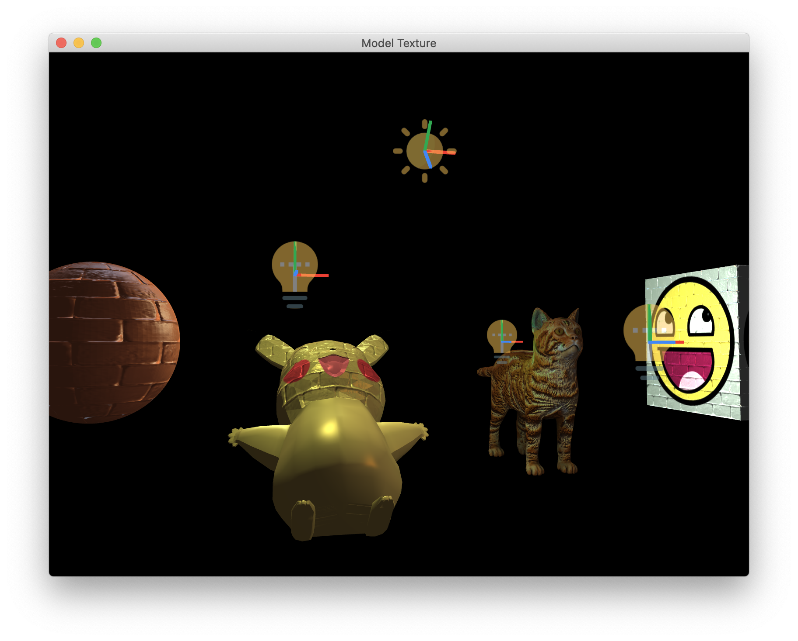

# Let's CG

Learning and Practice of Computer Graphics.

- Author: Yuehao Wang
- This project is recomposed from my homework of CG class (CS171) instructed by [Prof. Xiaopei Liu](http://faculty.sist.shanghaitech.edu.cn/faculty/liuxp/).

## Subprojects

- [OpenGL](https://github.com/yuehaowang/lets_CG/tree/master/OpenGL)

    Includes rasterization, coordinate transformation, texture mapping, normal mapping and Phong shading.

- [Loop Subdivision](https://github.com/yuehaowang/lets_CG/tree/master/loop_subdivision)

    An implementation of Loop subdivision algorithm.

- [Global Illumination](https://github.com/yuehaowang/lets_CG/tree/master/global_illumination)

    Implements ray tracing, Marte Carlo integral, grid acceleration structure, and importance sampling.

- [Volume Rendering](https://github.com/yuehaowang/lets_CG/tree/master/volume_rendering)

    A volume renderer with ray sampler, tri-linear/nearest-neighbor interpolation, transfer function and backward/forward composition.

## Results

- Global Illumination

- OpenGL

- For more results, please view each subproject.

## License

MIT License