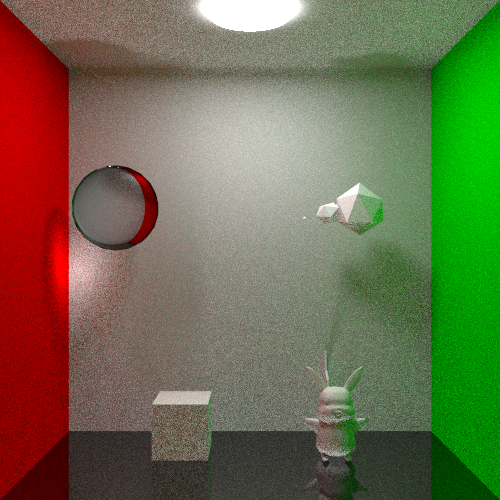

# Global Illumination

Global illumination using Monte-Carlo path tracing.

## Dependencies

- OpenMP
- Eigen
- stb_image

## Usage

1. Build this project:
    ```
    mkdir build && cd ./build
    cmake ..
    make
    ```
2. You can edit *src/main.cpp* to build your own scenes.

3. Guide to run a volume renderer:
    ```
    ./path-tracing [options]
    ```
    Options:
    
    - -num_samples: The number of integral samples for each pixel. Default: 30.
    - -max_depth: The max depth of path tracing. Default: 5.
    - -light_pow: Power of the light. Default: 48.
    - -num_threads: The number of using threads.
    - -out_dir: The output directory (default: *./*).


## Results

### Ideal Diffusion, Specular, and Refraction 

- (samples = 2048, max depth = 5)



- (samples = 16384, max depth = 5)


### Fresnel Effect

- (samples = 131072, max depth = 5)


## References

[Path tracing - Physically Based Rendering](http://www.pbr-book.org/3ed-2018/Light_Transport_I_Surface_Reflection/Path_Tracing.html)

[Ray-Plane and Ray-Disk Intersection](https://www.scratchapixel.com/lessons/3d-basic-rendering/minimal-ray-tracer-rendering-simple-shapes/ray-plane-and-ray-disk-intersection)

[Reflection, Refraction and Fresnel](https://www.scratchapixel.com/lessons/3d-basic-rendering/introduction-to-shading/reflection-refraction-fresnel)