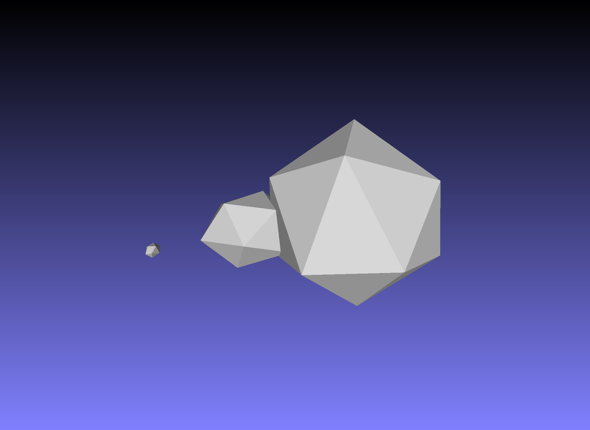
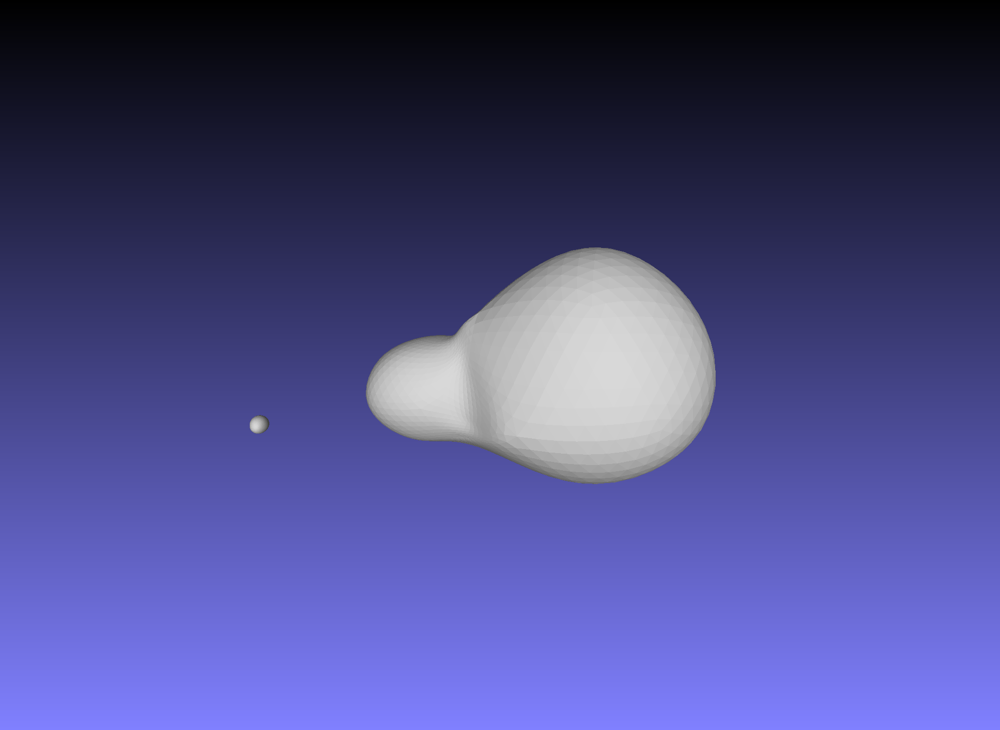
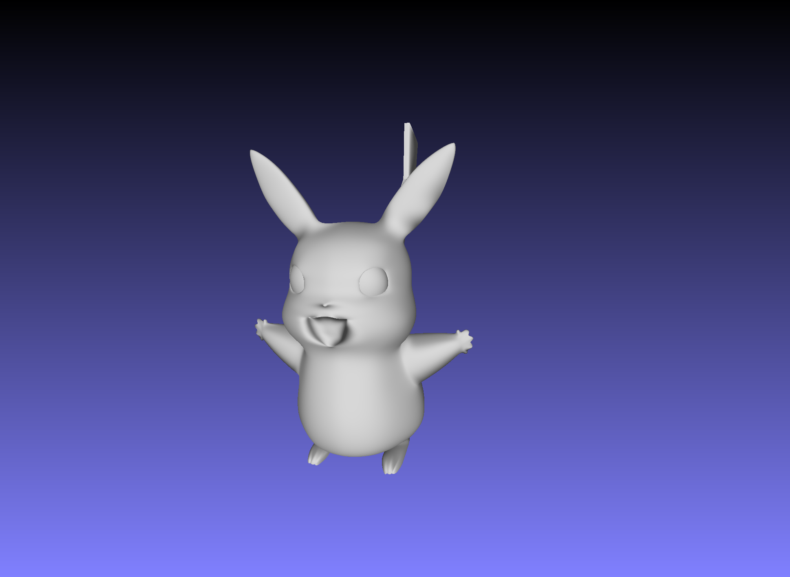

# Loop Subdivision

An implementation of Loop subdivision.

## Dependencies

- Eigen

## Usage

1. Build this project: 

    ```
    mkdir build && cd ./build
    cmake ..
    make
    ```

2. Place your .obj model to the *resources/* directory.

3. Suppose your model filename is *abc.obj*. Type the command to perform subdivision on your model:

    ```
    ./loop-subdivision abc
    ```

4. Result is saved to *abc_subdiv.obj*.


## Results

### Cloud_1

- Before:



- After subdivision:



### Pikachu

- Before:


- After subdivision:

