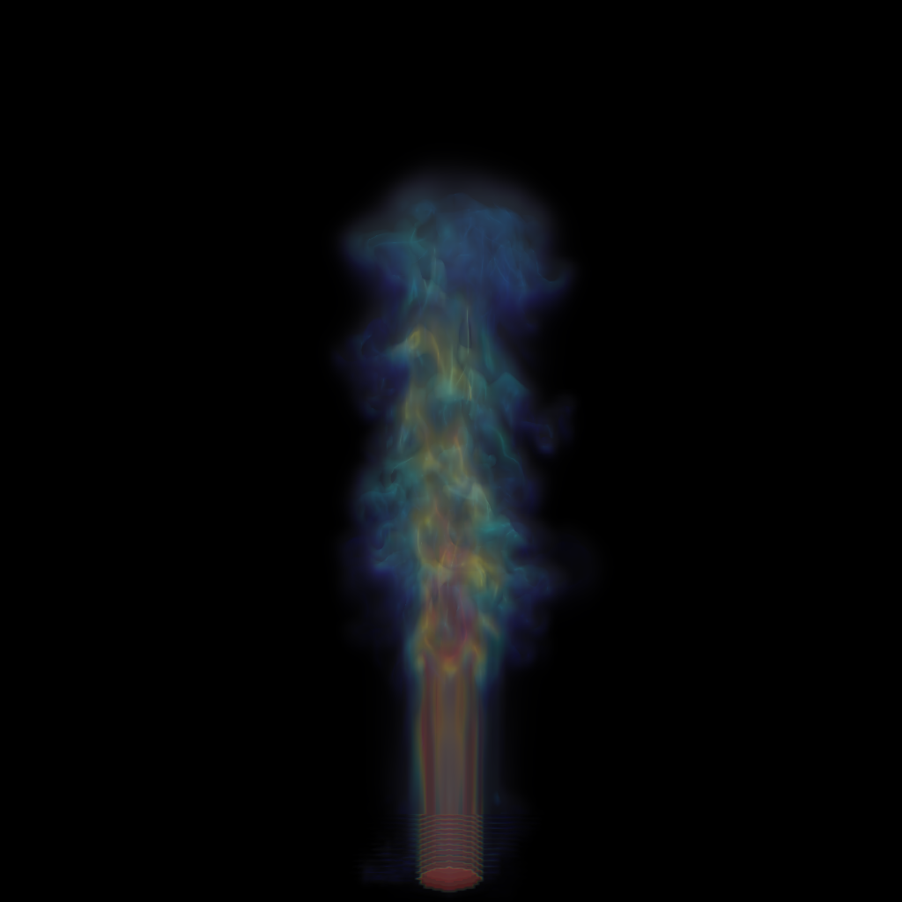

# Volume Rendering Using Ray-casting

A basic volume renderer with ray sampler, tri-linear/nearest-neighbor interpolator, Phong shading-based transfer function, front-to-back and back-to-front compositor.

## Dependencies

- Eigen
- stb_image
- [tinycolormap](https://github.com/yuki-koyama/tinycolormap)

## Usage

1. Build this project: 

    ```
    mkdir build && cd ./build
    cmake ..
    make
    ```

2. There are two volume data in the *data/* directory.

3. Guide to run a volume renderer:

    ```
    ./volume_rendering [options]
    ```
    Options:
    - -num_thread: The number of using threads.
    - -backward: Enable back-to-front composition.
    - -forward: Enable front-to-back composition.
    - -out_dir: The output directory (default: ./).
    - -in_dir: The input directory (default: data/).
    - -frame: The filename of the volume data to render (e.g. test2).
    - -out_res: The resolution of output. Default: 1024.
    - -sample_step: Length of sampling step. Default: 0.1.
    - -i_mth: Interpolation methods (tri/nn). Default: tri.
    - -cm: The name of colormap for visualization (see [Available Colormaps](https://github.com/yuki-koyama/tinycolormap#available-colormaps)).
    - -no-inscattering: Disable inscattering effects


## Results

- Trilinear interpolator, back-to-front composition, sampling step=0.01


- Trilinear interpolator, back-to-front composition, sampling step=0.1



- Nearest-neighbor interpolator, back-to-front composition, sampling step=0.01


- More results are placed in the *results/* directory.


## Related Resources

* [Volume Visualization and Volume Rendering Techniques](http://www.cs.unh.edu/~cs880/volvis/Meissner-VolRenderingEGTutorial.pdf)  

  A paper which introduces basic concept and common techniques of volume rendering.  

* [State of the Art in Transfer Functions for Direct Volume Rendering](https://www.researchgate.net/publication/304823671_State_of_the_Art_in_Transfer_Functions_for_Direct_Volume_Rendering)  

  A paper which describes the concept and common approaches of transfer functions.  
